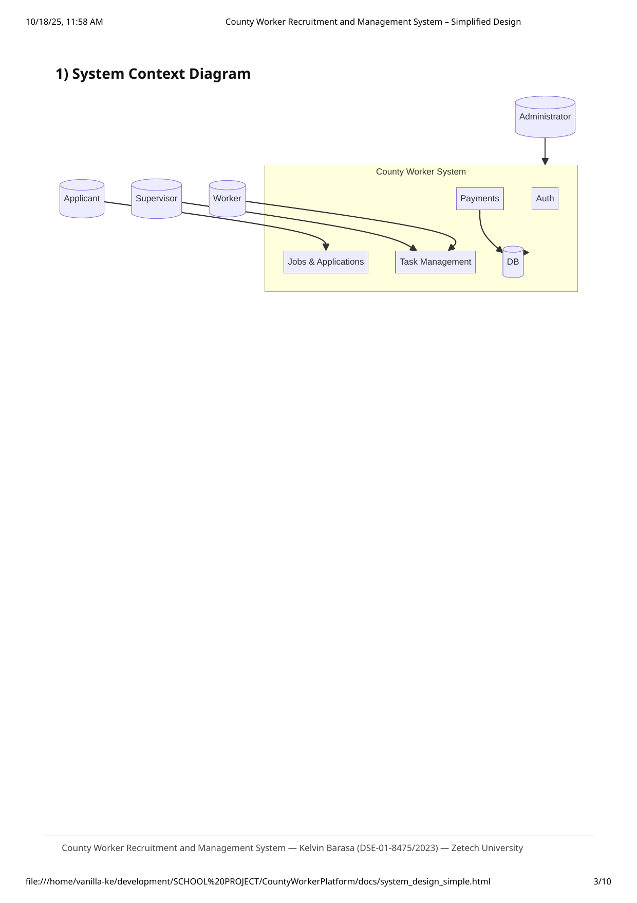
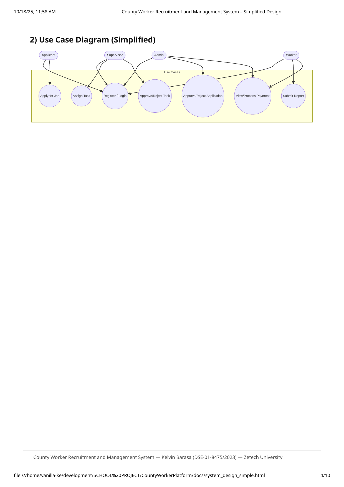
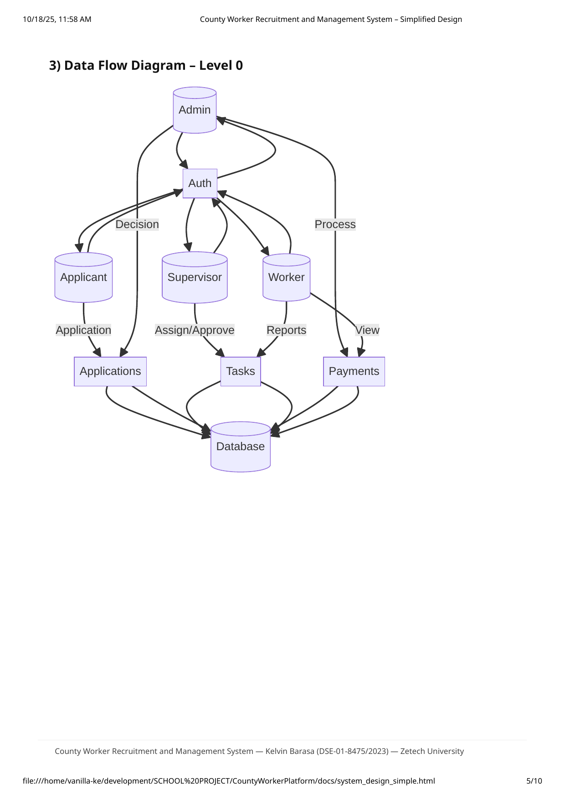
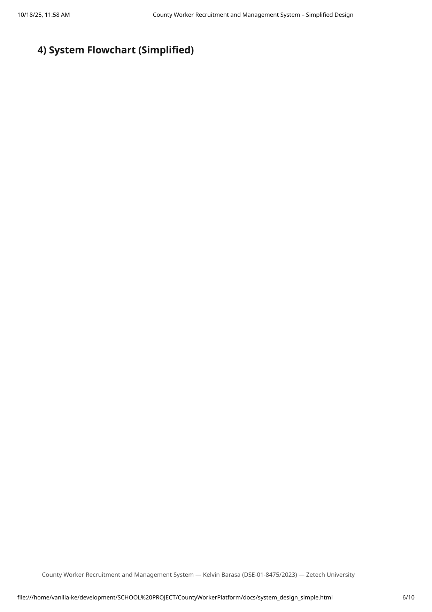
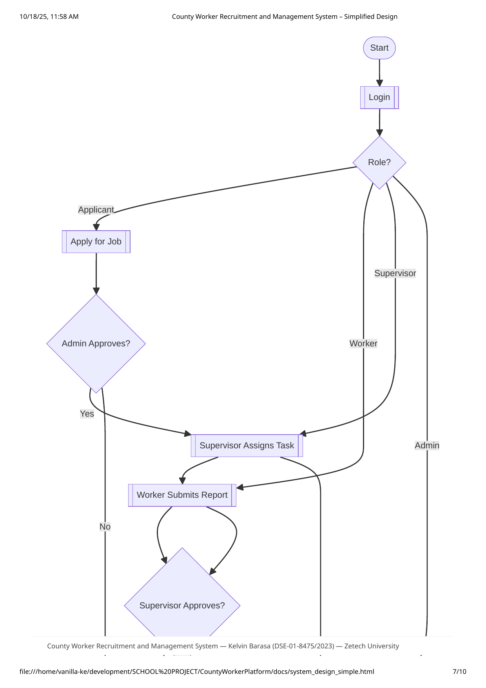
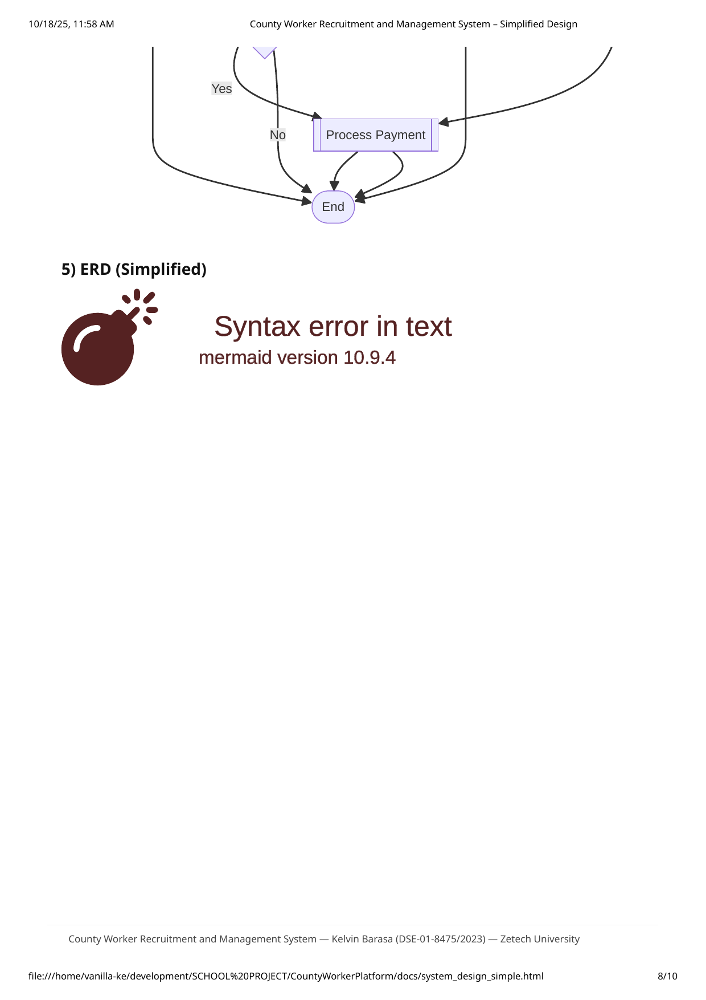
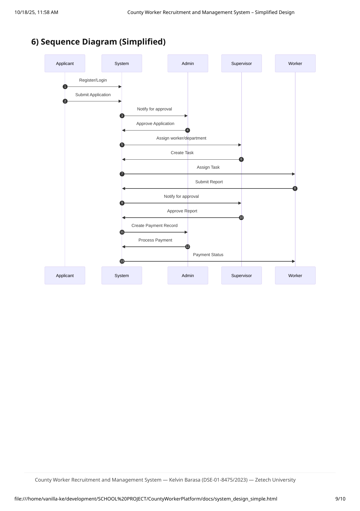

# County Worker Recruitment and Management System

Simplified System Analysis & Design (School Presentation)

- **Student Name:** Kelvin Barasa
- **Student ID:** DSE-01-8475/2023
- **Institution:** Zetech University

---

## Tools

- Laptop
- Flutter framework
- Dart language
- Python for back-end logic

## Next Steps (to check on 30-Sep)

Design and model:

- **Flowcharts:** https://www.visual-paradigm.com/tutorials/flowchart-tutorial/
  - Sign up
  - Login
  - Job application
  - Account management
  - Contract processing
  - Task management and payments

- **Class Diagram:** https://www.visual-paradigm.com/guide/uml-unified-modeling-language/uml-class-diagram-tutorial/
  - ONE class diagram with the following classes:
    - User class (with four child classes):
      - Applicant_class
      - Worker_class
      - Supervisor_class
      - HR_class
    - Job class
    - Application class
    - Task class
    - Contract class

- **Use case diagram (of the entire system):** https://www.visual-paradigm.com/guide/uml-unified-modeling-language/what-is-use-case-diagram/

- **Sequence diagram (of the entire system):** https://www.visual-paradigm.com/learning/handbooks/software-design-handbook/sequence-diagram.jsp

---

## 1) System Context Diagram

County Worker Recruitment and Management System — Kelvin Barasa (DSE-01-8475/2023) — Zetech University

{width=100%}

---

## 2) Use Case Diagram (Simplified)

County Worker Recruitment and Management System — Kelvin Barasa (DSE-01-8475/2023) — Zetech University

{width=100%}

---

## 3) Data Flow Diagram – Level 0

County Worker Recruitment and Management System — Kelvin Barasa (DSE-01-8475/2023) — Zetech University

{width=100%}

---

## 4) System Flowchart (Simplified)

County Worker Recruitment and Management System — Kelvin Barasa (DSE-01-8475/2023) — Zetech University

{width=100%}

---

## 5) ERD (Simplified)

County Worker Recruitment and Management System — Kelvin Barasa (DSE-01-8475/2023) — Zetech University

{width=100%}

---

## 6) Class Diagram (Simplified)

County Worker Recruitment and Management System — Kelvin Barasa (DSE-01-8475/2023) — Zetech University

{width=100%}

---

## 7) Sequence Diagram (Simplified)

County Worker Recruitment and Management System — Kelvin Barasa (DSE-01-8475/2023) — Zetech University

{width=100%}

---

## 8) Short Design Summary

- **Context:** Shows roles and the system boundary with key modules.
- **Use Cases:** Lists core actions for each actor needed for demo.
- **DFD L0:** Shows overall data movement between modules and users.
- **Flowchart:** Simple flow from login to approval, task, and payment.
- **ERD:** Minimal entities and relationships that match the running app.
- **Sequence:** End-to-end interaction from application to payment.
